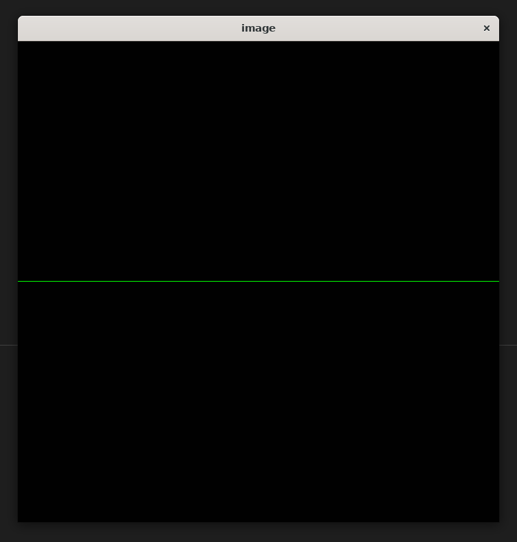

This is the LAB for JOHN Class 2023 Programming Practices: **GAMES101-RUST**

You can reach the lab requirements at [GAMES101-RUST-课程要求](https://notes.sjtu.edu.cn/NSJDEfvdTKGxbGRnm2WdxA)

You can reach the lab tutorial at [GAMES101-RUST-教程](https://notes.sjtu.edu.cn/s/nHmmmUAl8)

Use `git clone https://github.com/Kr-Panghu/GAMES101-RUST-2023` to get start.

---


## Environment Setup

### 1. 安装wsl2图形界面

参考 https://learn.microsoft.com/zh-cn/windows/wsl/tutorials/gui-apps

#### 先决条件

- 你需要**Windows 10版本 19044+** 或**Windows 11**才能访问此功能。

- 已安装适用于 vGPU 的驱动程序

  若要运行 Linux GUI 应用，应首先安装与以下系统匹配的驱动程序。 这样，就可以使用虚拟 GPU (vGPU)，使你可受益于硬件加速 OpenGL 渲染。

  - [**英特尔** GPU 驱动程序](https://www.intel.com/content/www/us/en/download/19344/intel-graphics-windows-dch-drivers.html)
  - [**Amd** GPU 驱动程序](https://www.amd.com/en/support)
  - [**Nvidia** GPU 驱动程序](https://www.nvidia.com/Download/index.aspx?lang=en-us)

#### 全新安装 - 没有以前的 WSL 安装

现在，可以在管理员 PowerShell 或 Windows 命令提示符中输入此命令，然后重启计算机来安装运行适用于 Linux 的 Windows 子系统 (WSL) 所需的全部内容。

PowerShell复制

```powershell
wsl --install
```

计算机完成重启后，安装将继续进行，并要求你输入用户名和密码。 这将是 Ubuntu 发行版的 Linux 凭据。

现在，可开始在 WSL 上使用 Linux GUI 应用了！

有关详细信息，检查[安装 WSL](https://learn.microsoft.com/zh-cn/windows/wsl/install)。

#### 现有 WSL 安装

如果已在计算机上安装 WSL，可通过从提升的命令提示符运行更新命令来更新到包含 Linux GUI 支持的最新版本。

1. 选择“开始”，键入 PowerShell，右键单击“Windows PowerShell”，然后选择“以管理员身份运行”。

2. 输入 WSL 更新命令：

   PowerShell复制

   ```powershell
   wsl --update
   ```

3. 需要重启 WSL，更新才能生效。 可通过在 PowerShell 中运行关闭命令来重启 WSL。

   PowerShell复制

   ```powershell
   wsl --shutdown
   ```

 备注

Linux GUI 应用仅受 WSL 2 支持，并且不能用于为 WSL 1 配置的 Linux 发行版。 了解[如何将发行版从 WSL 1 更改为 WSL 2](https://learn.microsoft.com/zh-cn/windows/wsl/basic-commands#set-wsl-version-to-1-or-2)。

#### 运行 Linux GUI 应用

从 Linux 终端运行以下命令，下载并安装这些常用的 Linux 应用程序。 如果使用的是不同于 Ubuntu 的发行版，则它可能使用与 apt 不同的包管理器。 安装 Linux 应用程序后，可在“开始”菜单中的发行版名称下找到它。 例如：`Ubuntu -> Microsoft Edge`。

WSL 上对 GUI 应用的支持不提供完整的桌面体验。 它依赖于 Windows 桌面，因此可能不支持安装以桌面为中心的工具或应用。 若要请求其他支持，可以在 [GitHub 上的 WSLg 存储库](https://github.com/microsoft/wslg/issues)中提交问题。

#### 更新发行版中的包

Bash 复制

```bash
sudo apt update
sudo apt upgrade
```

#### 安装 X11 应用（必须安装，否则无法显示图片）

X11 是 Linux 窗口管理系统，这是随它一起提供的各种应用和工具的集合，例如 xclock、xcalc 计算器、用于剪切和粘贴的 xclipboard、用于事件测试的 xev 等。有关详细信息，请参阅 [x.org 文档](https://www.x.org/wiki/UserDocumentation/GettingStarted/)。

Bash复制

```bash
sudo apt install x11-apps -y
```

若要启动，请输入要使用的工具的名称。 例如：

- `xcalc`, `xclock`, `xeyes` 可以输入 `xeyes` 测试，如果能弹出一个两只眼睛的小窗口，并且眼睛会跟着鼠标转。说明安装成功。

### 2. 下载代码库并安装相关软件包

```bash
yzd@LAPTOP-31GDUP0B:~$ git clone https://github.com/Kr-Panghu/GAMES101-RUST-2023
yzd@LAPTOP-31GDUP0B:~$ cd GAMES101-RUST-2023/John-GAMES101-rs-LAB1
yzd@LAPTOP-31GDUP0B:~/GAMES101-RUST-2023/John-GAMES101-rs-LAB1$ cargo run
......
error: failed to run custom build command for `opencv v0.77.0`

Caused by:
  process didn't exit successfully: `/home/yzd/GAMES101-RUST-2023/John-GAMES101-rs-LAB1/target/debug/build/opencv-1bb496a654bb89de/build-script-build` (exit status: 1)
  --- stdout
  === Running: "/usr/bin/cargo" "build" "--release" "--package" "opencv-binding-generator" "--bin" "binding-generator"
  cargo:rerun-if-env-changed=OPENCV4_NO_PKG_CONFIG
  cargo:rerun-if-env-changed=PKG_CONFIG_x86_64-unknown-linux-gnu
  cargo:rerun-if-env-changed=PKG_CONFIG_x86_64_unknown_linux_gnu
  cargo:rerun-if-env-changed=HOST_PKG_CONFIG
  cargo:rerun-if-env-changed=PKG_CONFIG
  cargo:rerun-if-env-changed=OPENCV4_STATIC
  cargo:rerun-if-env-changed=OPENCV4_DYNAMIC
  cargo:rerun-if-env-changed=PKG_CONFIG_ALL_STATIC
  cargo:rerun-if-env-changed=PKG_CONFIG_ALL_DYNAMIC
  cargo:rerun-if-env-changed=PKG_CONFIG_PATH_x86_64-unknown-linux-gnu
  cargo:rerun-if-env-changed=PKG_CONFIG_PATH_x86_64_unknown_linux_gnu
  cargo:rerun-if-env-changed=HOST_PKG_CONFIG_PATH
  cargo:rerun-if-env-changed=PKG_CONFIG_PATH
  cargo:rerun-if-env-changed=PKG_CONFIG_LIBDIR_x86_64-unknown-linux-gnu
  cargo:rerun-if-env-changed=PKG_CONFIG_LIBDIR_x86_64_unknown_linux_gnu
  cargo:rerun-if-env-changed=HOST_PKG_CONFIG_LIBDIR
  cargo:rerun-if-env-changed=PKG_CONFIG_LIBDIR
  cargo:rerun-if-env-changed=PKG_CONFIG_SYSROOT_DIR_x86_64-unknown-linux-gnu
  cargo:rerun-if-env-changed=PKG_CONFIG_SYSROOT_DIR_x86_64_unknown_linux_gnu
  cargo:rerun-if-env-changed=HOST_PKG_CONFIG_SYSROOT_DIR
  cargo:rerun-if-env-changed=PKG_CONFIG_SYSROOT_DIR
  cargo:rerun-if-env-changed=OPENCV_NO_PKG_CONFIG
  cargo:rerun-if-env-changed=PKG_CONFIG_x86_64-unknown-linux-gnu
  cargo:rerun-if-env-changed=PKG_CONFIG_x86_64_unknown_linux_gnu
  cargo:rerun-if-env-changed=HOST_PKG_CONFIG
  cargo:rerun-if-env-changed=PKG_CONFIG
  cargo:rerun-if-env-changed=OPENCV_STATIC
  cargo:rerun-if-env-changed=OPENCV_DYNAMIC
  cargo:rerun-if-env-changed=PKG_CONFIG_ALL_STATIC
  cargo:rerun-if-env-changed=PKG_CONFIG_ALL_DYNAMIC
  cargo:rerun-if-env-changed=PKG_CONFIG_PATH_x86_64-unknown-linux-gnu
  cargo:rerun-if-env-changed=PKG_CONFIG_PATH_x86_64_unknown_linux_gnu
  cargo:rerun-if-env-changed=HOST_PKG_CONFIG_PATH
  cargo:rerun-if-env-changed=PKG_CONFIG_PATH
  cargo:rerun-if-env-changed=PKG_CONFIG_LIBDIR_x86_64-unknown-linux-gnu
  cargo:rerun-if-env-changed=PKG_CONFIG_LIBDIR_x86_64_unknown_linux_gnu
  cargo:rerun-if-env-changed=HOST_PKG_CONFIG_LIBDIR
  cargo:rerun-if-env-changed=PKG_CONFIG_LIBDIR
  cargo:rerun-if-env-changed=PKG_CONFIG_SYSROOT_DIR_x86_64-unknown-linux-gnu
  cargo:rerun-if-env-changed=PKG_CONFIG_SYSROOT_DIR_x86_64_unknown_linux_gnu
  cargo:rerun-if-env-changed=HOST_PKG_CONFIG_SYSROOT_DIR
  cargo:rerun-if-env-changed=PKG_CONFIG_SYSROOT_DIR

  --- stderr
  === Using environment job server with the the amount of available jobs: 14
  === Crate version: Some("0.77.0")
  === Environment configuration:
  ===   OPENCV_PACKAGE_NAME = None
  ===   OPENCV_PKGCONFIG_NAME = None
  ===   OPENCV_CMAKE_NAME = None
  ===   OPENCV_CMAKE_BIN = None
  ===   OPENCV_VCPKG_NAME = None
  ===   OPENCV_LINK_LIBS = None
  ===   OPENCV_LINK_PATHS = None
  ===   OPENCV_INCLUDE_PATHS = None
  ===   OPENCV_DISABLE_PROBES = None
  ===   CMAKE_PREFIX_PATH = None
  ===   OpenCV_DIR = None
  ===   PKG_CONFIG_PATH = None
  ===   VCPKG_ROOT = None
  ===   VCPKGRS_DYNAMIC = None
  ===   OCVRS_DOCS_GENERATE_DIR = None
  ===   DOCS_RS = None
  ===   PATH = Some("/home/yzd/.local/bin:/usr/local/sbin:/usr/local/bin:/usr/sbin:/usr/bin:/sbin:/bin:/usr/games:/usr/local/games:/usr/lib/wsl/lib:/mnt/c/Windows/system32:/mnt/c/Windows:/mnt/c/Windows/System32/Wbem:/mnt/c/Windows/System32/WindowsPowerShell/v1.0/:/mnt/c/Windows/System32/OpenSSH/:/mnt/c/Program Files (x86)/NVIDIA Corporation/PhysX/Common:/mnt/c/Program Files/NVIDIA Corporation/NVIDIA NvDLISR:/mnt/c/Program Files/MATLAB/R2021b/bin:/mnt/d/Git/cmd:/mnt/d/Git/mingw64/bin:/mnt/d/Git/usr/bin:/mnt/c/Program Files (x86)/GnuWin32:/mnt/c/Program Files/Java/jdk-17/bin:/mnt/c/Program Files/Java/jdk-17/jre/bin:/mnt/e/graphz/Graphviz/bin:/mnt/c/Users/生如夏花，灿若星辰/.cargo/bin:/mnt/c/Users/生如夏花，灿若星辰/AppData/Local/Programs/Python/Python310/Scripts/:/mnt/c/Users/生如夏花，灿若星辰/AppData/Local/Programs/Python/Python310/:/mnt/c/Users/生如夏花，灿若星辰/AppData/Local/Microsoft/WindowsApps:/mnt/c/Users/生如夏花，灿若星辰/AppData/Local/Programs/Microsoft VS Code/bin:/mnt/c/mingw64/bin/mingw64/bin:/snap/bin")
  === Enabled features:
  ===   ALPHAMAT
  ===   ARUCO
  ===   ARUCO_DETECTOR
  ===   BARCODE
  ===   BGSEGM
  ===   BIOINSPIRED
  ===   CALIB3D
  ===   CCALIB
  ===   CUDAARITHM
  ===   CUDABGSEGM
  ===   CUDACODEC
  ===   CUDAFEATURES2D
  ===   CUDAFILTERS
  ===   CUDAIMGPROC
  ===   CUDAOBJDETECT
  ===   CUDAOPTFLOW
  ===   CUDASTEREO
  ===   CUDAWARPING
  ===   CVV
  ===   DEFAULT
  ===   DNN
  ===   DNN_SUPERRES
  ===   DPM
  ===   FACE
  ===   FEATURES2D
  ===   FLANN
  ===   FREETYPE
  ===   FUZZY
  ===   GAPI
  ===   HDF
  ===   HFS
  ===   HIGHGUI
  ===   IMGCODECS
  ===   IMGPROC
  ===   IMG_HASH
  ===   INTENSITY_TRANSFORM
  ===   LINE_DESCRIPTOR
  ===   MCC
  ===   ML
  ===   OBJDETECT
  ===   OPTFLOW
  ===   OVIS
  ===   PHASE_UNWRAPPING
  ===   PHOTO
  ===   PLOT
  ===   QUALITY
  ===   RAPID
  ===   RGBD
  ===   SALIENCY
  ===   SFM
  ===   SHAPE
  ===   STEREO
  ===   STITCHING
  ===   STRUCTURED_LIGHT
  ===   SUPERRES
  ===   SURFACE_MATCHING
  ===   TEXT
  ===   TRACKING
  ===   VIDEO
  ===   VIDEOIO
  ===   VIDEOSTAB
  ===   VIZ
  ===   WECHAT_QRCODE
  ===   XFEATURES2D
  ===   XIMGPROC
  ===   XOBJDETECT
  ===   XPHOTO
  === Detected probe priority based on environment vars: pkg_config: false, cmake: false, vcpkg: false
  === Probing the OpenCV library in the following order: environment, pkg_config, cmake, vcpkg_cmake, vcpkg
  === Can't probe using: environment, continuing with other methods because: Some environment variables are missing
  === Probing OpenCV library using pkg_config
  === Can't probe using: pkg_config, continuing with other methods because: `"pkg-config" "--libs" "--cflags" "opencv4"` did not exit successfully: exit status: 1
  error: could not find system library 'opencv4' required by the 'opencv' crate

  --- stderr
  Package opencv4 was not found in the pkg-config search path.
  Perhaps you should add the directory containing `opencv4.pc'
  to the PKG_CONFIG_PATH environment variable
  No package 'opencv4' found
  , `"pkg-config" "--libs" "--cflags" "opencv"` did not exit successfully: exit status: 1
  error: could not find system library 'opencv' required by the 'opencv' crate

  --- stderr
  Package opencv was not found in the pkg-config search path.
  Perhaps you should add the directory containing `opencv.pc'
  to the PKG_CONFIG_PATH environment variable
  No package 'opencv' found

  === Probing OpenCV library using cmake
  === cmake ninja probe command: "cmake" "-S" "/home/yzd/.cargo/registry/src/github.com-1ecc6299db9ec823/opencv-0.77.0/cmake" "-DOCVRS_PACKAGE_NAME=OpenCV" "-DCMAKE_BUILD_TYPE=Debug" "-G" "Ninja"
  === Probing with cmake ninja generator failed, will try Makefile generator, error: cmake returned an error
      stdout: "-- The C compiler identification is GNU 9.4.0\n-- The CXX compiler identification is GNU 9.4.0\n-- Detecting C compiler ABI info\n-- Detecting C compiler ABI info - done\n-- Check for working C compiler: /usr/bin/cc - skipped\n-- Detecting C compile features\n-- Detecting C compile features - done\n-- Detecting CXX compiler ABI info\n-- Detecting CXX compiler ABI info - done\n-- Check for working CXX compiler: /usr/bin/c++ - skipped\n-- Detecting CXX compile features\n-- Detecting CXX compile features - done\n-- Configuring incomplete, errors occurred!\nSee also \"/home/yzd/GAMES101-rs/target/debug/build/opencv-101fff161d5c3efb/out/cmake_probe_build/CMakeFiles/CMakeOutput.log\".\n"
      stderr: "CMake Error at CMakeLists.txt:5 (find_package):\n  By not providing \"FindOpenCV.cmake\" in CMAKE_MODULE_PATH this project has\n  asked CMake to find a package configuration file provided by \"OpenCV\", but\n  CMake did not find one.\n\n  Could not find a package configuration file provided by \"OpenCV\" with any\n  of the following names:\n\n    OpenCVConfig.cmake\n    opencv-config.cmake\n\n  Add the installation prefix of \"OpenCV\" to CMAKE_PREFIX_PATH or set\n  \"OpenCV_DIR\" to a directory containing one of the above files.  If \"OpenCV\"\n  provides a separate development package or SDK, be sure it has been\n  installed.\n\n\n"
  === cmake makefiles probe command: "cmake" "-S" "/home/yzd/.cargo/registry/src/github.com-1ecc6299db9ec823/opencv-0.77.0/cmake" "-DOCVRS_PACKAGE_NAME=OpenCV" "-DCMAKE_BUILD_TYPE=Debug" "-G" "Unix Makefiles"
  === Probing with cmake Makefile generator failed, will try deprecated find_package, error: cmake returned an error
      stdout: "-- The C compiler identification is GNU 9.4.0\n-- The CXX compiler identification is GNU 9.4.0\n-- Detecting C compiler ABI info\n-- Detecting C compiler ABI info - done\n-- Check for working C compiler: /usr/bin/cc - skipped\n-- Detecting C compile features\n-- Detecting C compile features - done\n-- Detecting CXX compiler ABI info\n-- Detecting CXX compiler ABI info - done\n-- Check for working CXX compiler: /usr/bin/c++ - skipped\n-- Detecting CXX compile features\n-- Detecting CXX compile features - done\n-- Configuring incomplete, errors occurred!\nSee also \"/home/yzd/GAMES101-rs/target/debug/build/opencv-101fff161d5c3efb/out/cmake_probe_build/CMakeFiles/CMakeOutput.log\".\n"
      stderr: "CMake Error at CMakeLists.txt:5 (find_package):\n  By not providing \"FindOpenCV.cmake\" in CMAKE_MODULE_PATH this project has\n  asked CMake to find a package configuration file provided by \"OpenCV\", but\n  CMake did not find one.\n\n  Could not find a package configuration file provided by \"OpenCV\" with any\n  of the following names:\n\n    OpenCVConfig.cmake\n    opencv-config.cmake\n\n  Add the installation prefix of \"OpenCV\" to CMAKE_PREFIX_PATH or set\n  \"OpenCV_DIR\" to a directory containing one of the above files.  If \"OpenCV\"\n  provides a separate development package or SDK, be sure it has been\n  installed.\n\n\n"
  === cmake find-package compile probe command: "cmake" "-S" "/home/yzd/.cargo/registry/src/github.com-1ecc6299db9ec823/opencv-0.77.0/cmake" "-DOCVRS_PACKAGE_NAME=OpenCV" "-DCMAKE_BUILD_TYPE=Debug" "--find-package" "-DCOMPILER_ID=GNU" "-DLANGUAGE=CXX" "-DMODE=COMPILE" "-DNAME=OpenCV"
  === Can't probe using: cmake, continuing with other methods because: cmake returned an error
      stdout: "OpenCV not found.\n"
      stderr: "CMake Error: Run 'cmake --help' for all supported options.\n"
  === Probing OpenCV library using vcpkg_cmake
  === Can't probe using: vcpkg_cmake, continuing with other methods because: Could not find Vcpkg tree: No vcpkg installation found. Set the VCPKG_ROOT environment variable or run 'vcpkg integrate install'
  === Probing OpenCV library using vcpkg
  === Can't probe using: vcpkg, continuing with other methods because: Could not find Vcpkg tree: No vcpkg installation found. Set the VCPKG_ROOT environment variable or run 'vcpkg integrate install', Could not find Vcpkg tree: No vcpkg installation found. Set the VCPKG_ROOT environment variable or run 'vcpkg integrate install'
  Error: "Failed to find installed OpenCV package using probes: environment, pkg_config, cmake, vcpkg_cmake, vcpkg, refer to https://github.com/twistedfall/opencv-rust#getting-opencv for help"
```

参考 https://github.com/twistedfall/opencv-rust#getting-opencv%20for%20help

#### Ubuntu:

```
sudo apt install libopencv-dev clang libclang-dev
```

#### Windows package

Installing OpenCV is easy through the following sources:

- from [chocolatey](https://chocolatey.org/), also install `llvm` package, it's required for building:

  ```
  choco install llvm opencv
  ```

  also set `OPENCV_LINK_LIBS`, `OPENCV_LINK_PATHS` and `OPENCV_INCLUDE_PATHS` environment variables (see below for details).

  Also, check the user guides [here](https://github.com/twistedfall/opencv-rust/issues/118#issuecomment-619608278) and [here](https://github.com/twistedfall/opencv-rust/issues/113#issue-596076777).

- from [vcpkg](https://docs.microsoft.com/en-us/cpp/build/vcpkg), also install `llvm` package, necessary for building:

  ```
  vcpkg install llvm opencv4[contrib,nonfree]
  ```

  You most probably want to set environment variable `VCPKGRS_DYNAMIC` to "1" unless you're specifically targeting a static build.

#### macOS package

  Get OpenCV from homebrew:

  - homebrew:

    ```
    brew install opencv
    ```

    You will also need a working C++ compiler and libclang, you can install Command Line Tools (`xcode-select --install`), XCode (from AppStore) or `llvm` (from Brew). You most probably need to also check the item 6 of the troubleshooting below.

按照上述操作解决完报错后，即可重新 `cargo run` 会显示如下界面，需要等几分钟

```shell
yzd@LAPTOP-31GDUP0B:~/GAMES101-RUST-2023/John-GAMES101-rs-LAB1$ cargo run
   Compiling opencv v0.77.0
   Compiling games101 v0.1.0 (/home/yzd/GAMES101-RUST-2023/John-GAMES101-rs-LAB1)
    Finished dev [unoptimized + debuginfo] target(s) in 1m 36s
     Running `target/debug/games101`
frame count: 0
frame count: 1
frame count: 2
frame count: 3
frame count: 4
frame count: 5
frame count: 6
frame count: 7
frame count: 8
frame count: 9
frame count: 10
frame count: 11
frame count: 12
frame count: 13
frame count: 14
frame count: 15
```

出现一行行的 `frame count: ` 和一张渲染好的图片即说明环境配置成功，正常来说，你可以在屏幕中央看到一条绿色的直线，如下图所示。



